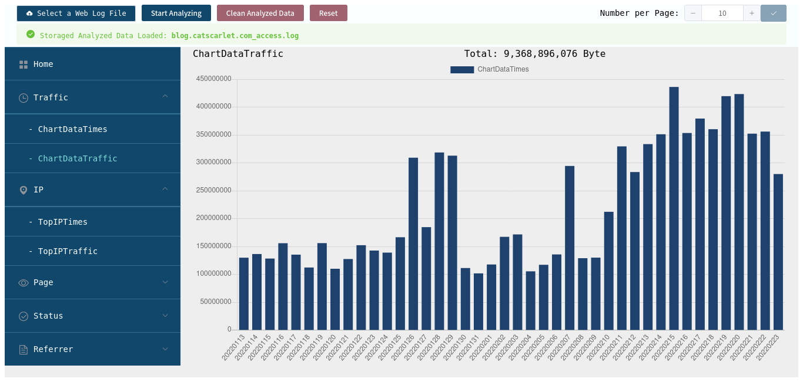
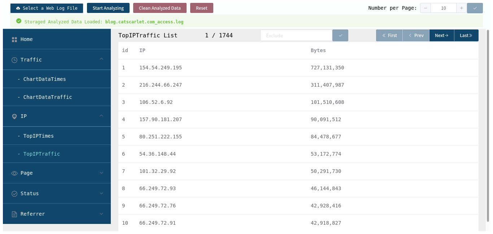

# Web-Log-Analyzer-IceFairy

## Introduction

这是一款 Client-Only 的 Web Log 的工具。

此款工具致力于在本地直接加载 apache.log 并进行分析。工具并不会向服务端发送任何数据，日志分析全部在本地浏览器中进行。

对日志的条目默认是以正则实现的，可以识别 apache 的默认日志格式 `LogFormat "%h %l %u %t \"%r\" %>s %b \"%{Referer}i\" \"%{User-Agent}i\""`

比如：

```
117.14.147.49 - - [21/Feb/2021:00:40:26 +0800] "GET / HTTP/1.1" 200 906 "https://www.catscarlet.com/" "Mozilla/5.0 (Windows NT 10.0; Win64; x64; rv:85.0) Gecko/20100101 Firefox/85.0"
```

目前不支持在界面定制默认日志格式。如果您需要使用自定义格式日志，请转换成默认格式，或修改 core.js 中的正则。

目前项目仍在开发中。

# 截图





## Demo

[Demo on Cloudflare](https://server2.catscarlet.com/demo/Web-Log-Analyzer-IceFairy/)

If you need a log-file as test simple, here is a log-file from my bike404-site:
- [Apache log simple on MEGA](https://mega.nz/#!OsNhxQCL!Rx3enFeVI4pJY0hp3zS2JlokGWx38UizbzLTcK2eLIY)
- [Apache log simple on BaiduNetDisk](https://pan.baidu.com/s/1CZD_dDxd4P_Fp6S0xv1uWw) \(Password: mnhq \)

## 3rd party libraries

- vue
- vue-router
- element-ui
- chart.js
- vue-chartjs

## Serve & Build

因为是 yarn.lock 所以：

- `yarn run serve`
- `yarn run build`

## Known-Issues

- 因为数据信息目前是保存在 locatstorage 中，当信息大于 5M 时（约30W条日志），**Chrome 可能直接崩溃并不提示任何相关信息**，Firefox 则会报错 `NS_ERROR_DOM_QUOTA_REACHED: Persistent storage maximum size reached` ，可修改 Firefox 的 `about:config` 中的 `dom.storage.default_quota` 来扩大限制。
- 没有分析进度，因为调用 setTimeout 会产生严重的浏览器 IDLE 时间，导致效率大幅下降（至少60倍）。
- Analyze Status 没有 Analyzing，不知为何 `vue.$nextTick()` 没有效果。
- 修改 `Number per Page` 会导致整页刷新，因为 vue-router 没有提供也不能实现当前路由重建重载。
- 如果在 `/ChartDataTraffic` 页面下尝试分析新的日志文件，页面将会刷新。与上一条相同的原因。
- Vue 以及 Element UI 仍然在使用旧版，更新可能会导致今天还能用，过一夜之后再编译就满页疮痍。基于 Element UI 的版本将不再维护，未来将考虑使用其他样式库。
- 暂不支持IPv6。

## Why named IceFairy

配色

## Contribute

Pull requests are welcome. Please sent pull request to dev branch.

## License

Mozilla Public License Version 2.0
